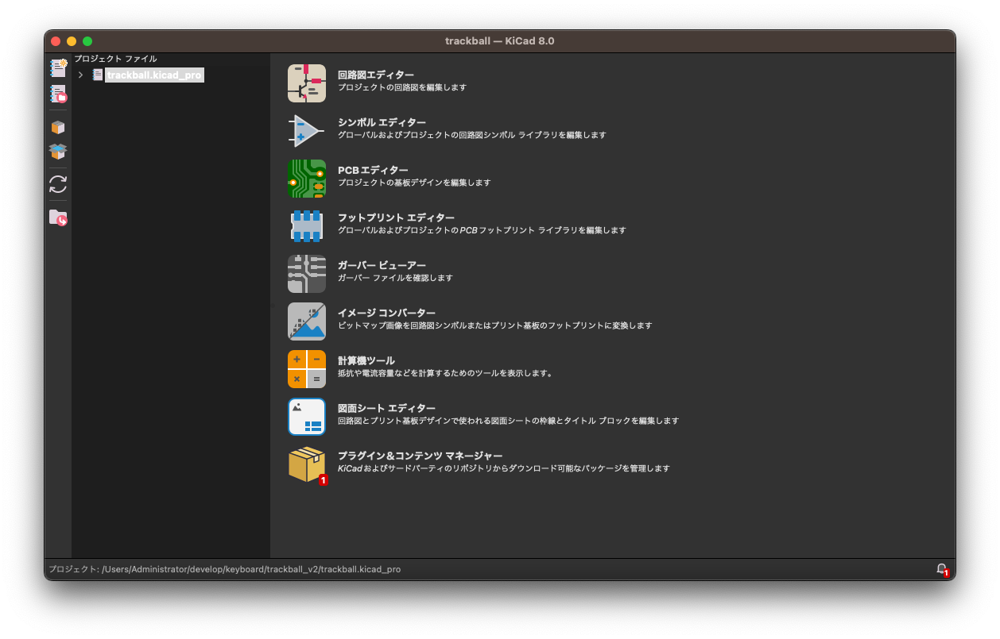
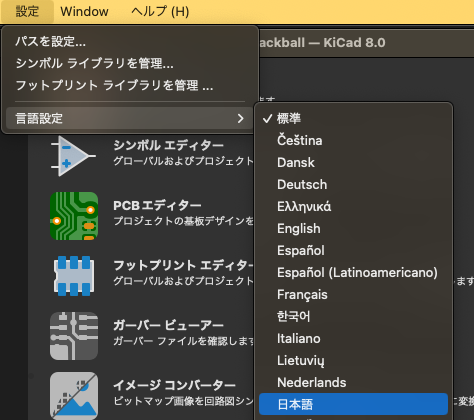
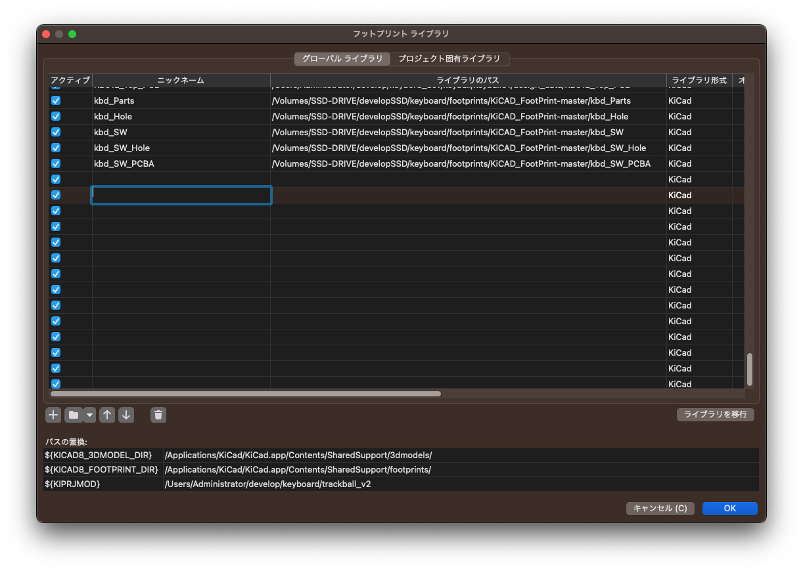

+++
title="自作キーボードの回路設計に向けて、KiCad環境を準備する"
description="KiCadのインストールからfootprint、プラグインの追加を説明します"
date=2025-01-12
author="tsuruno"

[taxonomies]
tags = ["DIY", "Keyboard", "KiCad"]
# categories = ["Keyboard"]

[extra]
poor = true
+++

#### はじめに

自作キーボードの基盤設計でよく使われるKiCadについて、導入と設定方法を説明します。

後から設定を弄ると設計に集中できないので、設計に集中できるように先にKiCadに色々準備していきます。

設計しているうちに分かってくるので、とりあえず無心でやっちゃいましょう。

#### KiCadをダウンロード

まずはKiCadをダウンロードしてインストールします。以下の手順を参照してください。

1. KiCad公式サイトにアクセス。
   [KiCad公式サイト](https://www.kicad.org/)

2. 自分のOSに対応したインストーラーをダウンロードし、画面の指示に従ってインストールを完了させる。

> **注意**: 古いOSを使用していて公式の最新バージョンが動作しない場合、GitHubから過去のバージョンをダウンロードすることができます。
> [GitHub – KiCad Releases](https://github.com/KiCad/kicad-source-mirror/releases)

#### KiCadを起動

インストールが完了したら、KiCadを起動します。

1. 初回起動時、プロジェクトを作成するための画面が表示されます。

   - **新規プロジェクトの作成**を選択し、作業用フォルダを指定してプロジェクトを保存します。

2. KiCadは複数のツールで構成されています。主要なツールは以下の通りです。

   - **Eeschema**: 回路図エディタ - 回路の接続や部品配置を視覚的に設計します。
   - **Pcbnew**: PCBデザインエディタ - 実際のプリント基板のレイアウトを作成します。
   - **Footprint Editor**: フットプリントの作成と編集 - 部品のパッドや形状を定義します。

3. 必要に応じて、環境設定から言語を選択できます。

#### フットプリントのライブラリを追加

キーボードの設計には、適切なフットプリントが必要です。
フットプリントとは、基板上で電子部品を正確に配置し、接続するためのランド（端子）やパターンの設計図を指します。
設計図を流用すれば効率も上がりますし、何より寸法のミスも減らせます。

以下の手順でカスタムライブラリを追加します。

1. 以下のリンクからキーボード用のフットプリントライブラリをダウンロードします。
リポジトリ丸ごとダウンロードしちゃいましょう。

   - [KiCAD_FootPrint](https://github.com/Salicylic-acid3/KiCAD_FootPrint)
     - Salicylic_kbd.libにパスを通して下さい。
   - [foostan/kbd](https://github.com/foostan/kbd)
   - [ai03-2725/random-keyboard-parts.pretty](https://github.com/ai03-2725/random-keyboard-parts.pretty)
   - [keebio/Keebio-Parts.pretty](https://github.com/keebio/Keebio-Parts.pretty)
     - .prettyのパスを通してあげて下さい

   ※この中に無い部品を追加したい場合は、一度公式情報を探すとフットプリントが公開されている場合があるので、探すことをお勧めします。

1. ダウンロードしたライブラリを任意のローカルディレクトリに保存します。

2. KiCadの**フットプリントライブラリマネージャ**を開き、次の手順で追加します。

   - [フットプリントライブラリ] > [追加ボタン(左下の＋マーク)]をクリック
   

   - 保存したライブラリディレクトリを指定し、ニックネーム(任意)と先ほどダウンロードしたリポジトリへのパスの指定を行います。

   - これでライブラリの追加は完了です。KiCad内で新しいフットプリントが使用できるようになりました。

追加されたフットプリントが正しく認識されているか確認するには、以下の手順をお試し下さい

1. **PCBエディター**を開きます。
2. メニューから**フットプリントブラウザ**を選択します。
3. 追加したニックネーム名を探し、フットプリントが追加されていることを確認します。

#### プラグインを追加

KiCadの機能を拡張するために、プラグインを追加します。

1. **KiCad Plugin and Content Manager**を起動します。

2. 以下のプラグインを検索し、インストールします。

   - **Interactive BOM**: ボム(部品表)を自動生成するツール
     - [公式GitHubページ](https://github.com/openscopeproject/InteractiveHtmlBom)
   - **KiBuzzard**: ラベルやバッジを簡単に生成するツール
     - [公式GitHubページ](https://github.com/Gasman2014/KiBuzzard)
   - **JCLPCB fablication toolkit**: JLCPCB向けの製造データを効率よく準備するためのツール。製造仕様に沿ったデータ生成が簡単になる
     - [公式GitHubページ](https://github.com/bouni/kicad-jlcpcb-tools)

3. プラグインの設定については、各プラグインの公式ドキュメントやGitHubページを参照してください。

#### まとめ

本記事では、KiCadの導入と設定方法について解説しました
設計頑張りましょ！
